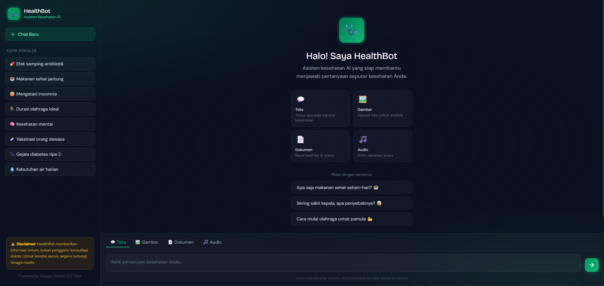
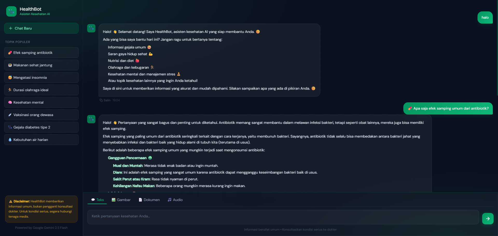

# 🩺 HealthBot - Asisten Kesehatan AI

> **Final Project - AI Productivity and AI API Integration for Developers**  
> Organized by **Hacktiv8** | Powered by **Google Gemini 2.5 Flash**

---

## 📖 Deskripsi Proyek

**HealthBot** adalah chatbot kesehatan berbasis AI yang dibangun menggunakan **Google Gemini 2.5 Flash API**. Chatbot ini mampu menjawab berbagai pertanyaan seputar kesehatan secara natural dan empatik, serta mendukung berbagai jenis input dari pengguna.

### ✨ Fitur Utama

| Input | Deskripsi | Endpoint |
|-------|-----------|----------|
| 💬 **Teks** | Tanya langsung seputar kesehatan | `POST /api/chat/text` |
| 🖼️ **Gambar** | Upload foto untuk analisis visual | `POST /api/chat/image` |
| 📄 **Dokumen** | Baca & jelaskan hasil lab / resep | `POST /api/chat/document` |
| 🎵 **Audio** | Transkripsi & analisis rekaman suara | `POST /api/chat/audio` |

### 🎯 Use Case

- Informasi gejala umum & pertolongan pertama
- Saran nutrisi, diet, dan gaya hidup sehat
- Tips olahraga dan kebugaran
- Dukungan kesehatan mental
- Penjelasan dokumen medis (hasil lab, resep)
- Analisis foto kulit / kondisi fisik
- Transkripsi rekaman suara tentang keluhan

---

## 🛠️ Tech Stack

- **Backend:** Node.js v18+, Express.js v5, Multer
- **AI Model:** Google Gemini 2.5 Flash (`@google/genai`)
- **Frontend:** Vanilla JavaScript, HTML5, CSS3
- **Styling:** Tailwind CSS (CDN)
- **Markdown:** Marked.js
- **Other:** dotenv, cors

---

## 📁 Struktur Folder

```
hackiv8-healthbot-gemini/
├── public/
│   └── index.html        # Frontend SPA (UI chatbot)
├── .env                  # API key (jangan di-commit!)
├── .gitignore
├── index.js              # Express server + semua API endpoint
├── package.json
└── README.md
```

---

## 🚀 Cara Menjalankan

### 1. Clone & Install

```bash
git clone https://github.com/NunoRifa/hackiv8-healthbot-gemini.git
cd hackiv8-healthbot-gemini
npm install
```

### 2. Setup Environment

Buat file `.env` di root folder:

```env
GEMINI_API_KEY=your_gemini_api_key_here
PORT=3000
```

> Dapatkan API key di: https://aistudio.google.com/app/apikey

### 3. Jalankan Server

```bash
# Production
npm start

# Development (auto-restart)
npm run dev
```

### 4. Buka Browser

```
http://localhost:3000
```

---

## 📡 API Endpoints

### `POST /api/chat/text`
```json
// Request body (JSON)
{
  "message": "Apa saja gejala diabetes?",
  "history": [
    { "role": "user", "text": "Halo!" },
    { "role": "model", "text": "Halo! Ada yang bisa saya bantu?" }
  ]
}

// Response
{ "result": "Gejala diabetes meliputi..." }
```

### `POST /api/chat/image`
```
// Form-data
image: <file>
message: "Apa kondisi kulit ini?" (opsional)

// Response
{ "result": "Berdasarkan gambar..." }
```

### `POST /api/chat/document`
```
// Form-data
document: <file>
message: "Jelaskan hasil lab ini" (opsional)

// Response
{ "result": "Dokumen ini berisi..." }
```

### `POST /api/chat/audio`
```
// Form-data
audio: <file>
message: "Transkripsi dan analisis" (opsional)

// Response
{ "result": "Audio menyebutkan..." }
```

---

## ⚙️ Konfigurasi Gemini

| Parameter | Value | Keterangan |
|-----------|-------|------------|
| `model` | `gemini-2.5-flash` | Model Gemini terbaru |
| `temperature` | `0.5–0.7` | Keseimbangan kreativitas & akurasi |
| `topP` | `0.85–0.9` | Nucleus sampling |
| `topK` | `40` | Top-K token |
| `systemInstruction` | Custom | Persona HealthBot |

---

## ⚠️ Disclaimer

> HealthBot memberikan **informasi kesehatan umum** dan bukan pengganti **konsultasi dokter profesional**. Untuk kondisi medis serius atau darurat, segera hubungi tenaga medis atau pergi ke fasilitas kesehatan terdekat.

---

## 📸 Screenshots





---

## 👤 Author

- **Nama:** Nuno Rigo Fadilah (Nuno Rifa)
- **Program:** AI Productivity and AI API Integration for Developers
- **Organizer:** Hacktiv8
- **Supported by:** Google.org & Asian Development Bank

---

## 📄 Lisensi

ISC License - bebas digunakan untuk keperluan edukasi.